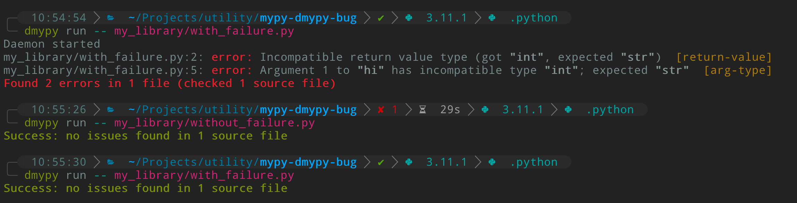

``mypy`` daemon bug demonstration
=================================

This is a demonstration of an annoying ``dmypy`` bug::

    > source run.sh activate
    > dmypy run -- my_library/with_failure.py
    > dmypy run -- my_library/without_failure.py
    > dmypy run -- my_library/with_failure.py

You'll see that it displays the errors for ``with_failure.py`` until we run it
with a different path, and then it says that file has no more errors.

I noticed this when trying to figure out why ``pylsp-mypy`` was being weird.
